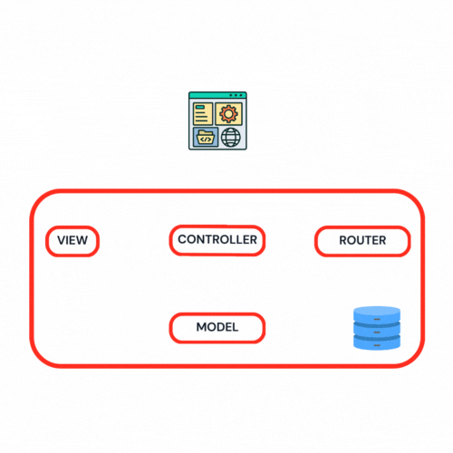

# MVC Pattern

Laravel follows the Model-View-Controller (MVC) architecture,  Here's an overview of how Laravel's MVC architecture is structured:

- **Routes**: Routes define the URLs and corresponding controller actions. They map incoming requests to the appropriate controller method.
- **Controllers**: Controllers handle user requests and manage the flow of data. They receive input from users, interact with models, and return responses. Controllers contain methods (actions) that define the logic for each route.
- **Models**: Models represent the data and business logic of the application. They interact with the database and provide an abstraction layer for retrieving, creating, updating, and deleting data. Models encapsulate the application's data structure and define relationships between entities.
- **Views**: Views are responsible for presenting data to users. They contain the HTML templates and UI components that render the final output. Views can access data from models and controllers to display information.

